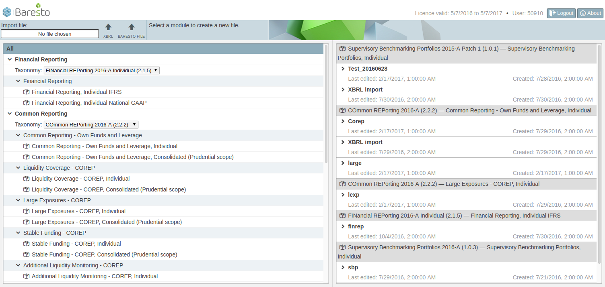
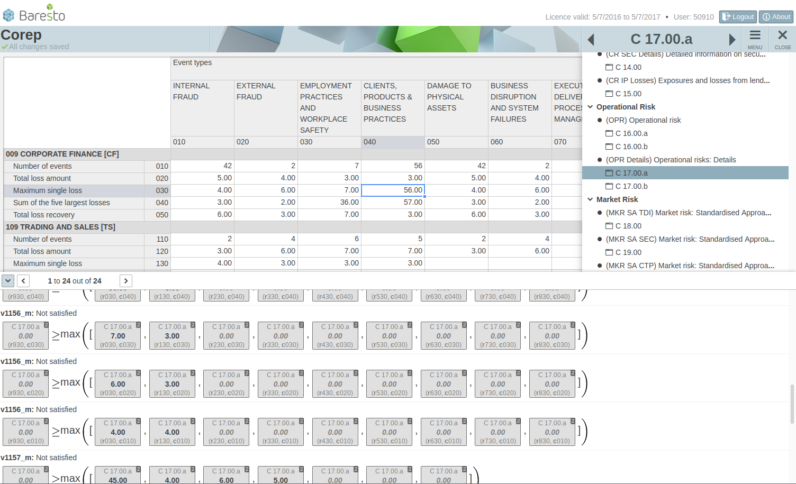

# Baresto

PureScript UI of the regulatory reporting software
[Baresto](https://baresto.metrix-frs.de/).

## First Setup

### Install Node.js

Preferably via [NVM](https://github.com/creationix/nvm):

    $ curl -o- https://raw.githubusercontent.com/creationix/nvm/v0.31.0/install.sh | bash
    $ nvm install 4
    $ nvm alias default 4

Check version:

    $ node -v
    > v4.4.3

### Install Bower and Gulp

    $ npm install -g bower
    $ npm install -g gulp

### Clone and Get Dependencies

    $ git clone git://github.com/metrix-frs/baresto.git
    $ cd baresto/
    $ npm install
    $ bower update

## Build

    $ API_URL= gulp

## Watch

Starts browserSync, reloads when the compiled JS has changed and automatically
compiles and injects CSS.

    $ gulp watch

## Serve

Install [core](https://gitlab.mdrexl.net/holger/core).

Assuming you have cloned core next to where you have cloned lobster:

    $ cd core/
    $ stack build
    $ stack exec server -- -s ../baresto/public
